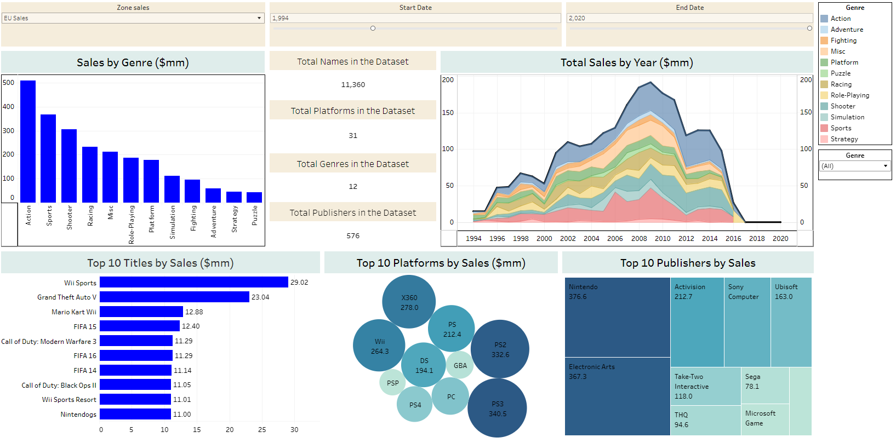

# Video_Game_Sales_2019

## Introduction

Building a simple, interactive Tableau dashboard summarizing global video game sales data from 1980 to 2020. 

* Pandas was used to clean the dataset and export to csv.
* The cleaned dataset was imported and manipulated in Tableau Desktop. 

## Sales Dashboard

*[This link leads to the dashboard](https://public.tableau.com/views/Video_game_sales_16885042311970/Dashboard1?:language=en-US&:display_count=n&:origin=viz_share_link)

This dashboard analyzes the following datapoints and can be filtered by Geography(Zone) and year range. All figures are in $ millions.
* Total Sales by Year 
* Sales by Genre
* Top 10 Titles by Sales
* Top 10 Platforms by Sales
* Top 10 Publishers by Sales

## Datasets used

Access the source Kaggle dataset and description [here](https://www.kaggle.com/datasets/gregorut/videogamesales)

*[Source Data](vgsales.csv)
